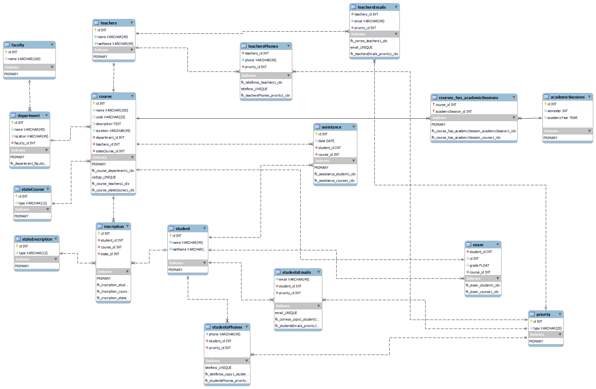

# BASE DE DATOS INSTITUCIONAL

## MODELO CONCEPTUAL

- Una escuela/universidad tiene diferentes departamentos que ofrecen cursos a los alumnos en una determinada sesión 
académica. 
- Cada uno de estos cursos lo imparte un profesor. 
- Los alumnos pueden inscribirse en diferentes cursos en una sesión académica. 
- Además de los detalles de registro, la universidad/escuela debe mantener también la información principal sobre el alumno. 
- El departamento mantiene los datos de asistencia del alumno, que determinarán si un alumno puede optar a los exámenes 
de esa sesión académica o no. 
- Para cada sesión académica, se realizan exámenes y los resultados se comparten con el alumno en un período de tiempo 
estipulado. 
-  El departamento también mantiene un registro del tiempo de conexión y desconexión del profesorado para sus necesidades 
de generación de informes

## MODELO FISICO

## DESCRIPCION TABLAS

 

## 1. Conectar al Servidor de Base de Datos

Abre un cliente de línea de comandos o una interfaz gráfica que te permita conectarte a tu servidor de bases de datos MySQL o MariaDB.

`mysql -u tu_usuario -p`

Reemplaza tu_usuario con el nombre de usuario de tu base de datos.

## 2. Crear la Base de Datos

`CREATE DATABASE nombre_de_tu_base_de_datos;`

Reemplaza nombre_de_tu_base_de_datos con el nombre que desees para tu base de datos.

## 3. Seleccionar la Base de Datos

`USE nombre_de_tu_base_de_datos;`

Esto te permitirá ejecutar comandos dentro de esa base de datos.

## Ejecutar el Script SQL

Puedes copiar el script contenido dentro `.sql` y pegarlo en tu consola para generar la ejecucion.

## INFORMACION ADICIONAL 

Para obtener más detalles sobre la estructura de las tablas y cómo utilizar la base de datos, consulta la sección correspondiente en este archivo.

Si surge algún problema durante estos pasos, asegúrate de que estás utilizando las credenciales y rutas correctas.